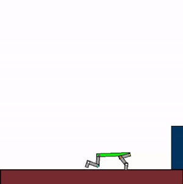
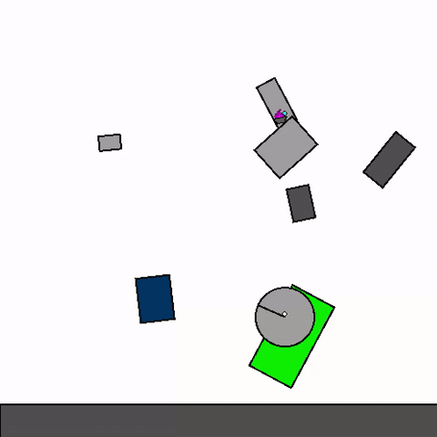

<p align="middle">
  
</p>

<p align="center">
        <a href= "https://pypi.org/project/jax2d/">
        </a>
       <a href= "https://github.com/FLAIROx/Kinetix/blob/main/LICENSE">
        </a>
       <a href= "https://github.com/psf/black">
        </a>
       <a href= "https://kinetix-env.github.io/">
        </a>
       <a href= "https://arxiv.org/abs/2410.23208">
        </a>
        <a href= "./docs/README.md">
        </a>
</p>

# Kinetix

Kinetix is a framework for reinforcement learning in a 2D rigid-body physics world, written entirely in [JAX](https://github.com/jax-ml/jax).
Kinetix can represent a huge array of physics-based tasks within a unified framework.
We use Kinetix to investigate the training of large, general reinforcement learning agents by procedurally generating millions of tasks for training.
You can play with Kinetix in our [online editor](https://kinetix-env.github.io/), or have a look at the JAX [physics engine](https://github.com/MichaelTMatthews/Jax2D) and [graphics library](https://github.com/FLAIROx/JaxGL) we made for Kinetix. Finally, see our [docs](./docs/README.md) for more information and more in-depth examples.

<p align="middle">
  
  
  
</p>
<p align="middle">
  
  
  
</p>

<p align="middle">
<b>The above shows specialist agents trained on their respective levels.</b>
</p>

# 📊 Paper TL; DR


We train a general agent on millions of procedurally generated physics tasks.
Every task has the same goal: make the <span style="color:green">green</span> and <span style="color:blue">blue</span> touch, without <span style="color:green">green</span> touching <span style="color:red">red</span>.
The agent can act through applying torque via motors and force via thrusters.

<p align="middle">
  
  
  
</p>
<p align="middle">
  
  
  
</p>

<p align="middle">
<b>The above shows a general agent zero-shotting unseen randomly generated levels.</b>
</p>

We then investigate the transfer capabilities of this agent to unseen handmade levels.
We find that the agent can zero-shot simple physics problems, but still struggles with harder tasks.

<p align="middle">
  
  
  
</p>
<p align="middle">
  
  
  
</p>

<p align="middle">
<b>The above shows a general agent zero-shotting unseen handmade levels.</b>
</p>


# 📜 Basic Usage

Kinetix follows the interfaces established in [gymnax](https://github.com/RobertTLange/gymnax) and [jaxued](https://github.com/DramaCow/jaxued):

```python
# Use default parameters
env_params = EnvParams()
static_env_params = StaticEnvParams()
ued_params = UEDParams()

# Create the environment
env = make_kinetix_env_from_args(
    obs_type="pixels",
    action_type="multidiscrete",
    reset_type="replay",
    static_env_params=static_env_params,
)

# Sample a random level
rng = jax.random.PRNGKey(0)
rng, _rng = jax.random.split(rng)
level = sample_kinetix_level(_rng, env.physics_engine, env_params, static_env_params, ued_params)

# Reset the environment state to this level
rng, _rng = jax.random.split(rng)
obs, env_state = env.reset_to_level(_rng, level, env_params)

# Take a step in the environment
rng, _rng = jax.random.split(rng)
action = env.action_space(env_params).sample(_rng)
rng, _rng = jax.random.split(rng)
obs, env_state, reward, done, info = env.step(_rng, env_state, action, env_params)
```


# ⬇️ Installation
To install Kinetix with a CUDA-enabled JAX backend (tested with python3.10):
```commandline
git clone https://github.com/FlairOx/Kinetix.git
cd Kinetix
pip install -e .
pre-commit install
```

# 🎯 Editor
We recommend using the [KinetixJS editor](https://kinetix-env.github.io/gallery.html?editor=true), but also provide a native (less polished) Kinetix editor.

To open this editor run the following command.
```commandline
python3 kinetix/editor.py
```

The controls in the editor are:
- Move between `edit` and `play` modes using `spacebar`
- In `edit` mode, the type of edit is shown by the icon at the top and is changed by scrolling the mouse wheel.  For instance, by navigating to the rectangle editing function you can click to place a rectangle.
  - You can also press the number keys to cycle between modes.
- To open handmade levels press ctrl-O and navigate to the ones in the L folder.  
- **When playing a level use the arrow keys to control motors and the numeric keys (1, 2) to control thrusters.**

# 📈 Experiments

We have three primary experiment files,
1. [**SFL**](https://github.com/amacrutherford/sampling-for-learnability?tab=readme-ov-file): Training on levels with high learnability, this is how we trained our best general agents.
2. **PLR** PLR/DR/ACCEL in the [JAXUED](https://github.com/DramaCow/jaxued) style.
3. **PPO** Normal PPO in the [PureJaxRL](https://github.com/luchris429/purejaxrl/) style.

To run experiments with default parameters run any of the following:
```commandline
python3 experiments/sfl.py
python3 experiments/plr.py
python3 experiments/ppo.py
```

We use [hydra](https://hydra.cc/) for managing our configs.  See the `configs/` folder for all the hydra configs that will be used by default.
If you want to run experiments with different configurations, you can either edit these configs or pass command line arguments as so:

```commandline
python3 experiments/sfl.py model.transformer_depth=8
```

These experiments use [wandb](https://wandb.ai/home) for logging by default.

## 🏋️ Training RL Agents
We provide several different ways to train RL agents, with the three most common options being, (a) [Training an agent on random levels](#training-on-random-levels), (b) [Training an agent on a single, hand-designed level](#training-on-a-single-hand-designed-level) or (c) [Training an agent on a set of hand-designed levels](#training-on-a-set-of-hand-designed-levels).

> [!WARNING]
> Kinetix has three different environment sizes, `s`, `m` and `l`. When running any of the scripts, you have to set the `env_size` option accordingly, for instance, `python3 experiments/ppo.py train_levels=random env_size=m` would train on random `m` levels.
> It will give an error if you try and load large levels into a small env size, for instance `python3 experiments/ppo.py train_levels=m env_size=s` would error.

### Training on random levels
This is the default option, but we give the explicit command for completeness
```commandline
python3 experiments/ppo.py train_levels=random
```
### Training on a single hand-designed level

> [!NOTE]
> Check the `worlds/` folder for handmade levels for each size category. By default, the loading functions require a relative path to the `worlds/` directory

```commandline
python3 experiments/ppo.py train_levels=s train_levels.train_levels_list='["s/h4_thrust_aim.json"]'
```
### Training on a set of hand-designed levels
```commandline
python3 experiments/ppo.py train_levels=s env_size=s eval_env_size=s
# python3 experiments/ppo.py train_levels=m env_size=m  eval_env_size=m
# python3 experiments/ppo.py train_levels=l env_size=l  eval_env_size=l
```

Or, on a custom set:
```commandline
python3 experiments/ppo.py train_levels=l eval_env_size=l env_size=l train_levels.train_levels_list='["s/h2_one_wheel_car","l/h11_obstacle_avoidance"]'
```

# ❌ Errata
- The left wall was erroneously misplaced 5cm to the left in all levels and all experiments in the paper (each level is a square with side lengths of 5 metres). This error has been fixed in the latest version of Jax2D, but we have pinned Kinetix to the old version for consistency and reproducability with the original paper.

# 🔎 See Also
- 🌐 [Kinetix.js](https://github.com/Michael-Beukman/Kinetix.js) Kinetix reimplemented in Javascript, with a live demo [here](https://kinetix-env.github.io/gallery.html?editor=true).
- 🍎 [Jax2D](https://github.com/MichaelTMatthews/Jax2D) The physics engine we made for Kinetix.
- 👨‍💻 [JaxGL](https://github.com/FLAIROx/JaxGL) The graphics library we made for Kinetix.
- 📋 [Our Paper](https://arxiv.org/abs/2410.23208) for more details and empirical results.

# 📚 Citation
Please cite Kinetix it as follows:
```
@article{matthews2024kinetix,
      title={Kinetix: Investigating the Training of General Agents through Open-Ended Physics-Based Control Tasks}, 
      author={Michael Matthews and Michael Beukman and Chris Lu and Jakob Foerster},
      year={2024},
      eprint={2410.23208},
      archivePrefix={arXiv},
      primaryClass={cs.LG},
      url={https://arxiv.org/abs/2410.23208}, 
}
```
