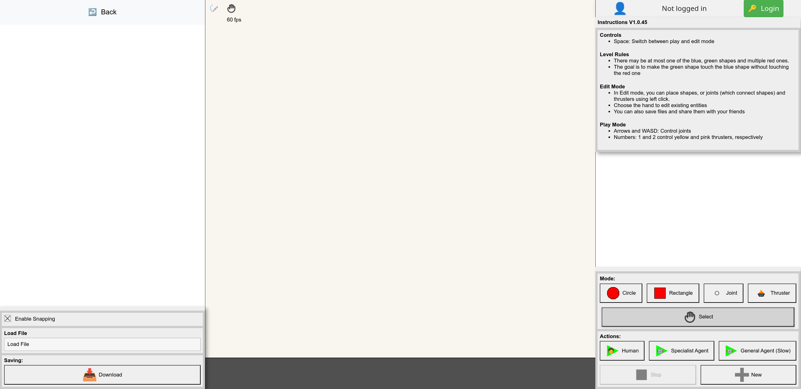
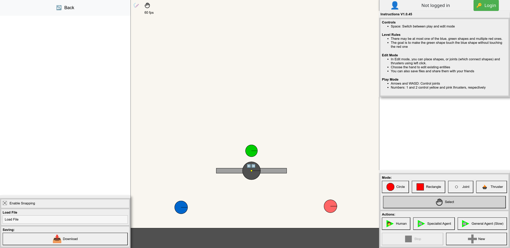
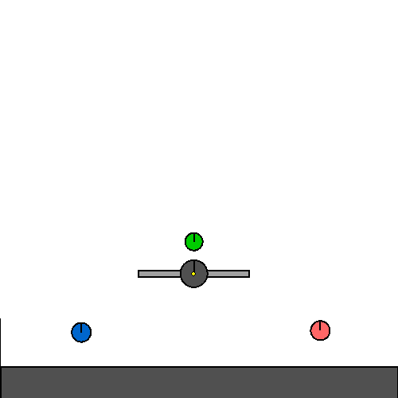

# Documentation
This is intended to provide some more details about how Kinetix works, including more in-depth examples. If you are interested in the configuration options, see [here](./configs.md).

- [Documentation](#documentation)
  - [Different Versions of Kinetix Environments](#different-versions-of-kinetix-environments)
    - [Action Spaces](#action-spaces)
    - [Observation Spaces](#observation-spaces)
  - [Resetting Functionality](#resetting-functionality)
  - [Using Kinetix to easily design your own JAX Environments](#using-kinetix-to-easily-design-your-own-jax-environments)
    - [Step 1 - Design an Environment](#step-1---design-an-environment)
    - [Step 2 - Export It](#step-2---export-it)
    - [Step 3 - Import It](#step-3---import-it)
    - [Step 4 - Train](#step-4---train)


## Different Versions of Kinetix Environments
We provide several different variations on the standard Kinetix environment, where the primary difference is the action and observation spaces.

Each of the environments has a different name, of the following form: `Kinetix-<OBS>-<ACTION>-v1`, and can be made using the `make_kinetix_env_from_name` helper function.
### Action Spaces
For all action spaces, the agent can control joints and thrusters. Joints have a property `motor_binding`, which is a way to tie different joints to the same action. Two joints that have the same binding will always perform the same action, likewise for thrusters.

We have three observation spaces, discrete, continuous and multi-discrete (which is the default). 
- **Discrete** has `2 * num_motor_bindings + num_thruster_bindings + 1` options, one of which can be active at any time. There are two options for every joint, i.e., backward and forward at full power. There is one option for each thruster, to activate it at full power. The final option is a no-op, meaning that no torque or force is applied to joints/thrusters.
- **Continuous** has shape `num_motor_bindings + num_thruster_bindings`, where each motor element can take a value between -1 and 1, and thruster elements can take values between 0 and 1.
- **Multi-Discrete**: This is a discrete action space, but allows multiple joints and thrusters to be active at any one time. The agent must output a flat vector of size `3 * num_motor_bindings + 2 * num_thruster_bindings`. For joints, each group of three represents a categorical distribution of `[0, -1, +1]` and for thrusters it represents `[0, +1]`.

### Observation Spaces
We provide three primary observation spaces, Symbolic-Flat (called just symbolic), Symbolic-Entity (called entity, which is also the default) and Pixels.
- **Symbolic-Flat** returns a large vector, which is the flattened representation of all shapes and their properties.
- **Symbolic-Entity** also returns a vector representation of all entities, but does not flatten it, instead returning it in a form that can be used with permutation-invariant network architectures, such as transformers.
- **Pixels** returns an image representation of the scene. This is partially observable, as features such as the restitution and density of shapes is not shown.


Each observation space has its own pros and cons. **Symbolic-Flat** is the fastest by far, but has two clear downsides. First, it is restricted to a single environment size, e.g. a model trained on `small` cannot be run on `medium` levels. Second, due to the large number of symmetries (e.g. any permutation of the same shapes would represent the same scene but would look very different in this observation space), this generalises worse than *entity*.

**Symbolic-Entity** is faster than pixels, but slower than Symbolic-Flat. However, it can be applied to any number of shapes, and is natively permutation invariant. For these reasons we chose it as the default option.

Finally, **Pixels** runs the slowest, and also requires more memory, which means that we cannot run as many parallel environments. However, pixels is potentially the most general format, and could theoretically allow transfer to other domains and simulators.


## Resetting Functionality
We have two primary resetting functions that control the environment's behaviour when an episode ends. The first of these is to train on a known, predefined set of levels, and resetting samples a new level from this set. In the extreme case, this also allows training only on a single level in the standard RL manner. The other main way of resetting is to sample a *random* level from some distribution, meaning that it is exceedingly unlikely to sample the same level twice.

## Using Kinetix to easily design your own JAX Environments
Since Kinetix has a general physics engine, you can design your own environments and train RL agents on them very fast! This section in the docs describes this pipeline.
### Step 1 - Design an Environment
You can go to our [online editor](https://kinetix-env.github.io/gallery.html?editor=true). You can also have a look at the [gallery](https://kinetix-env.github.io/gallery.html) if you need some inspiration.

The following two images show the main editor page, and then the level I designed, where you have to spin the ball the right way. While designing the level, you can play it to test it out, seeing if it is possible and of the appropriate difficulty.


<p align="middle">
  
  
</p>

### Step 2 - Export It
Once you are satisfied with your level, you can download it as a json file by using the button on the bottom left. Once this is downloaded, move it to `$KINETIX_ROOT/worlds/custom/my_custom_level.json`, where `$KINETIX_ROOT` is the root of the Kinetix repo.


### Step 3 - Import It
In python, you can import the level as follows, see `examples/example_premade_level_replay.py` for an example.
```python
from kinetix.util.saving import load_from_json_file
level, static_env_params, env_params = load_from_json_file("worlds/custom/my_custom_level.json")
```

### Step 4 - Train
You can use the above if you want to import the level and play around with it. If you want to train an RL agent on this level, you can do the following (see [here](https://github.com/FLAIROx/Kinetix?tab=readme-ov-file#training-on-a-single-hand-designed-level) from the main README).

```commandline
python3 experiments/ppo.py env_size=custom \
                           env_size.custom_path=custom/my_custom_level.json \
                           train_levels=s \
                           train_levels.train_levels_list='["custom/my_custom_level.json"]' \
                           eval=eval_auto
```

And the agent will start training, with videos on this on [wandb](https://wandb.ai).
<p align="middle">
  
</p>